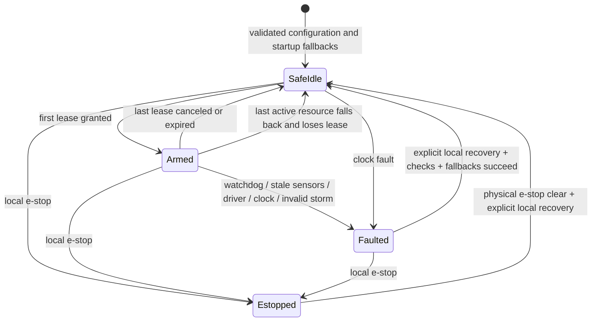

# Runtime state machine

Initialization validates the table and attempts fallback on every configured
resource. It fails if any startup fallback fails. The runtime then enters
`SafeIdle`, or `Estopped` if the initial local flags include e-stop.

An expiry of one resource leaves the runtime armed if another lease remains.
Faults revoke all leases. Driver fallback failure cannot lead to automatic recovery.
E-stop stays latched when sensor flags clear; clearing the flag alone never rearms.
Recovery grants no authority: hosts must acquire fresh leases.

## Safety epoch

The global epoch starts at 1 and increases for authority acquisition/revocation,
local state flag changes, e-stop/fallback and recovery. Renewal and ordinary
setpoint updates do not change it. Continuous IMU/encoder measurements are not
epoch events unless the platform derives a discrete safety-relevant flag change.
Actions must match the current epoch exactly. This v0 policy is conservative;
it can reject otherwise harmless actions after an unrelated resource transition.

Epoch, lease and receipt counters never wrap. Exhaustion latches a fault and
requires a new boot session. Local time is monotonic u64 milliseconds; checked
addition prevents duration wraparound.

## Timing order

Each admission/control API services the supervisor before processing its request.
Expiry at equality wins over a renewal or action at that tick. Default watchdog
service budget is 50 ms; default local sensor age limit is 250 ms. `tick` must also
run with no traffic. A software watchdog detects late progress only when called;
the external hardware watchdog covers total loss of execution.
